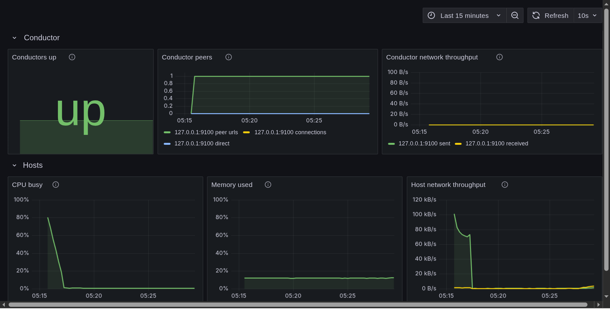

# Introduction

nixos-holochain runs a Holochain conductor, its hApps and the monitoring around them from a NixOS flake you write yourself. It was built at [Sensorica](https://sensorica.co) for a room of five Holoports, and it is meant for anyone in the Holochain community who wants an edgenode they can read, change and roll back.

## The gap it fills

Holochain has two deployment stories. Holonix gives developers a Nix environment, and it is mature. HolOS gives production edgenodes a Buildroot appliance image, which you flash and run but do not author. Nothing in between lets you describe a node declaratively and deploy it to commodity hardware.

These modules are that middle path. One `nixos-rebuild` brings up a conductor with its keystore, installs your hApps at boot, and, if you ask for it, exports the conductor's own network metrics to a Prometheus and Grafana stack that ships with provisioned dashboards.



## What is in the repository

- **Seven NixOS modules.** `holochain-edgenode` is the core: conductor, in-process lair keystore, an idempotent hApp installer and optional metrics, on both the 0.7 and the 0.6 Holochain lines from one option set. `holochain-grafana` adds Prometheus and Grafana for a fleet, `holochain-http-gateway` serves chosen zome functions over HTTP, `holochain-bootstrap` runs your own bootstrap and relay server, and `holochain-windtunnel` lends a machine to the Holochain Foundation's test cluster, off by default. `holochain-moss-node` runs a Moss group's always-online node beside the edgenode, and `sensorica-event-node` is the Sensorica workshop's profile (Holochain line, hApps and network seed) layered on it.

- **Two flake templates.** `nix flake init -t github:Sensorica/nixos-holochain#minimal` writes one edgenode; `#fleet` writes five nodes with Grafana, a Colmena hive and a live ISO.

- **A worked fleet.** `examples/sensorica-fleet` is the Sensorica Lab's own flake: five Holoports, an operator desk and a workshop ISO.

- **NixOS VM tests for every module**, built in CI, so a claim in these pages about what a module does has a test behind it.

## Where it stands

The modules work and are VM-tested on Holochain 0.7.0 and 0.6.3. The open work is hardware: deploying the full five-machine fleet to real Holoports is tracked in issues [#8](https://github.com/Sensorica/nixos-holochain/issues/8) to [#12](https://github.com/Sensorica/nixos-holochain/issues/12). The project is licensed [MIT](https://github.com/Sensorica/nixos-holochain/blob/main/LICENSE) and succeeds the archived [Sensorica/holoports-workshop](https://github.com/Sensorica/holoports-workshop).

## Three ways through this book

**You are installing a Holoport**, at a workshop or as the operator of a fleet. Start with the [Deployment guide](deployment.md), which walks a Holoport from an empty disk to a verified conductor, then read [The Sensorica Lab fleet](sensorica-fleet.md) for how the lab's machines are laid out. Workshop participants have a [handout](workshop/participant-handout.md) and a [pre-flight checklist](workshop/preflight-checklist.md); facilitators have their own [guide](workshop/facilitator-guide.md).

**You run NixOS and want the modules on your own machines.** Read the [Architecture](architecture.md) for how the conductor, the installer and the observability stack fit together, then keep the [Module options](module-options.md) reference open. [Starting from a template](templates/minimal.md) gets a first node evaluating, [hApp bundles](happs.md) covers where `.happ` files come from, and [Moss always-online node](moss-node.md) runs a Moss group's headless node.

**You want to change the code.** [Contributing](contributing.md) sets the rules: open an issue first, every new module ships a VM test, and the option reference is regenerated in the same commit as any option change. [Releasing](releasing.md) is how a version is tagged, and the [architecture decision records](adr/README.md) are the design decisions behind the code. The [archive](archive/README.md) records the December 2025 HolOS workshop this project grew out of.

## Building this book

The book's sources are the Markdown files under `docs/`, with `docs/SUMMARY.md` as the table of contents. From the repository root:

```bash
nix develop -c mdbook serve --open
```

Without the dev shell, `nix shell nixpkgs#mdbook -c mdbook build` writes the site to `book/`.
